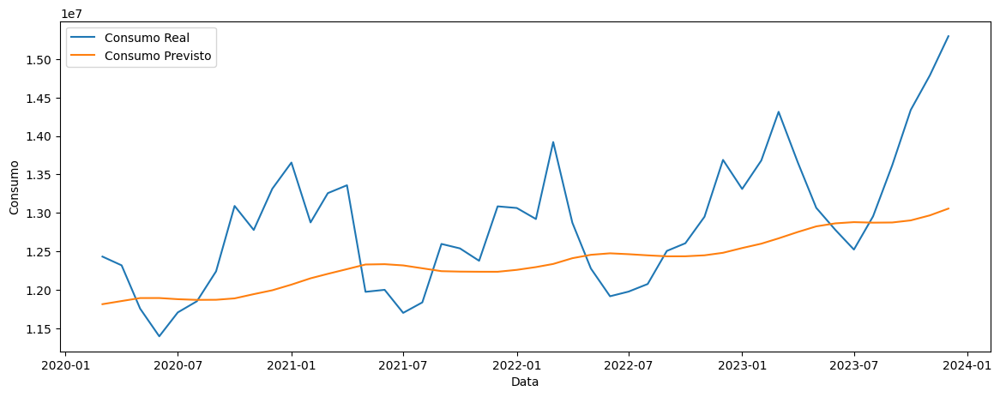
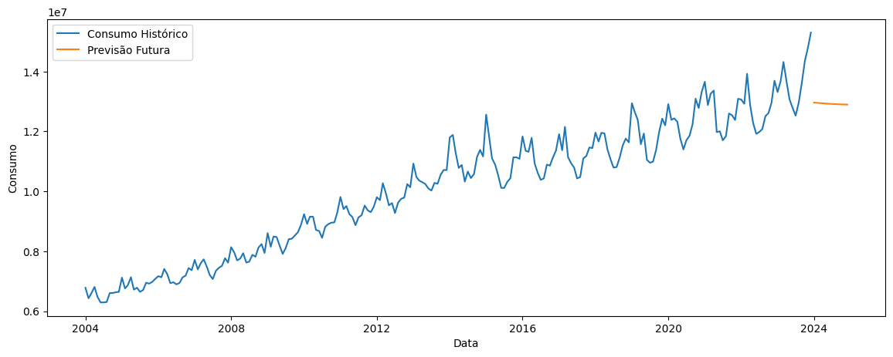

# Previsão de Consumo de Energia Elétrica com Rede Neural LSTM

Este projeto utiliza uma Rede Neural Recorrente LSTM para prever o consumo mensal de energia elétrica residencial no Brasil a partir de dados históricos. A previsão do consumo de energia é essencial para ajudar no planejamento e uso eficiente de recursos. Este projeto visa prever o consumo dos próximos 12 meses com base nos dados históricos fornecidos.

## Objetivo

Usar uma rede LSTM para prever o consumo mensal de energia elétrica residencial no Brasil.

## Fonte de Dados

O conjunto de dados utilizado está disponível na plataforma [Base dos Dados](https://basedosdados.org/dataset/3e31e540-81ba-4665-9e72-3f81c176adad?table=b955feef-1649-428b-ba46-bc891d2facc2). O arquivo `consumo_eletrico_brasil.csv` contém dados mensais de consumo residencial de energia ao longo de vários anos.

## Estrutura do Projeto

- **notebooks/**: Contém o notebook Jupyter com o código completo de análise exploratória, pré-processamento, modelagem e previsão.
- **imagens/**: Imagens e gráficos gerados durante o projeto.
- **README.md**: Documento com a explicação completa do projeto.

## Etapas do Projeto

### 1. Entendimento do Problema

A previsão do consumo de energia elétrica é fundamental para o planejamento adequado e para a eficiência do uso de recursos. Utilizamos dados históricos de consumo de energia no Brasil para treinar um modelo LSTM, visando prever o consumo nos próximos 12 meses.

### 2. Análise Exploratória dos Dados

Na análise exploratória, verificamos as características dos dados, incluindo:
- Evolução do consumo ao longo do tempo.
- Análise de tendências e sazonalidades.
- Identificação de valores ausentes e tratamento.

Os gráficos de evolução do consumo mostraram uma tendência de crescimento ao longo dos anos, com variações sazonais. 

### 3. Tratamento dos Dados

O tratamento dos dados incluiu as seguintes etapas:
- **Filtragem**: Consideramos apenas o consumo residencial.
- **Agregação**: Agrupamos os dados por data, somando o consumo e o número de consumidores.
- **Normalização**: Utilizamos `MinMaxScaler` para normalizar as colunas `consumo` e `numero_consumidores` para o intervalo [0, 1].
- **Divisão em Treino e Teste**: Dividimos os dados em 80% para treino e 20% para teste.
- **Criação de Sequências Temporais**: Utilizamos os últimos 12 meses como entrada para prever o próximo mês.

### 4. Desenvolvimento do Modelo LSTM

#### Descrição do Modelo
Utilizamos uma rede neural LSTM, ideal para séries temporais devido à sua capacidade de capturar dependências de longo prazo nos dados.

#### Arquitetura do Modelo
A arquitetura do modelo LSTM consiste em:
- **Uma camada LSTM** com 50 neurônios.
- **Uma camada de Dropout** com taxa de 0,2 para evitar overfitting.
- **Uma camada densa** de saída com ativação linear.
  
O modelo foi compilado com o otimizador Adam e a função de perda MSE (Erro Quadrático Médio).

### 5. Previsão para os Próximos 12 Meses

Após o treinamento do modelo, geramos previsões para os dados de teste e para os próximos 12 meses. Os gráficos abaixo mostram:
- A comparação entre os valores reais e os valores previstos no conjunto de teste.
- As previsões para o consumo dos próximos 12 meses.

### 6. Resultados e Conclusões

#### Precisão do Modelo
A precisão do modelo foi baixa, com um erro quadrático médio (MSE) de aproximadamente 753 bi e uma raiz do erro quadrático médio (RMSE) de cerca de 867 mil. Esses valores elevados sugerem que as previsões estão significativamente distantes dos valores reais de consumo, reforçando que o modelo está subajustado para os dados. O comportamento linear nas previsões dos próximos 12 meses confirma que o modelo não conseguiu capturar adequadamente a sazonalidade e os picos característicos do consumo energético.

#### Importância do Número de Consumidores
O número de consumidores foi incluído como uma variável adicional, pois ele influencia diretamente o consumo total de energia. A inclusão dessa variável ajuda o modelo a capturar melhor o comportamento dos dados.

#### Sugestões de Melhorias
1. **Ajuste de Hiperparâmetros**: Experimentar com uma quantidade maior de neurônios na camada LSTM, adicionar mais camadas LSTM e ajustar a taxa de Dropout podem ajudar o modelo a capturar melhor as variações nos dados.

2. **Incremento da Arquitetura do Modelo**: Explorar arquiteturas mais complexas, como a combinação de LSTM com camadas de atenção, ou até modelos baseados em Transformers, que podem capturar dependências temporais de maneira mais eficaz.

3. **Incorporação de Variáveis Externas**: Incluir dados adicionais, como variáveis climáticas ou econômicas, que podem influenciar o consumo de energia, ajudaria o modelo a entender melhor os fatores que causam as oscilações no consumo.

4. **Expansão do Conjunto de Dados**: Se possível, aumentar a quantidade de dados históricos para que o modelo tenha mais informações sobre padrões de longo prazo.

Essas melhorias poderiam aumentar a precisão do modelo e sua capacidade de prever com mais realismo o consumo energético futuro.